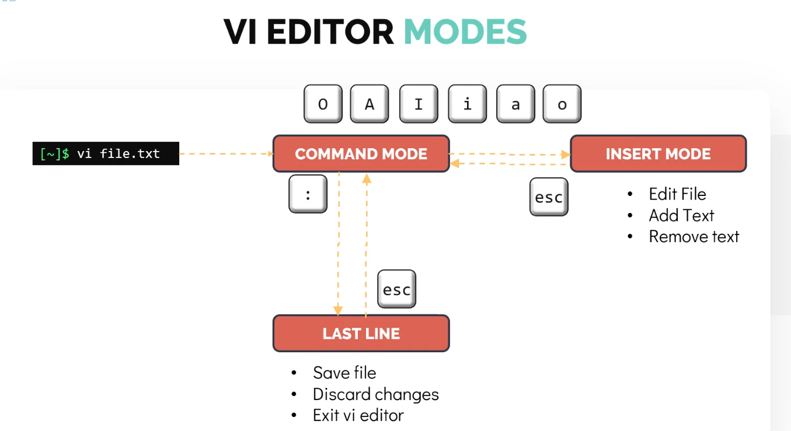
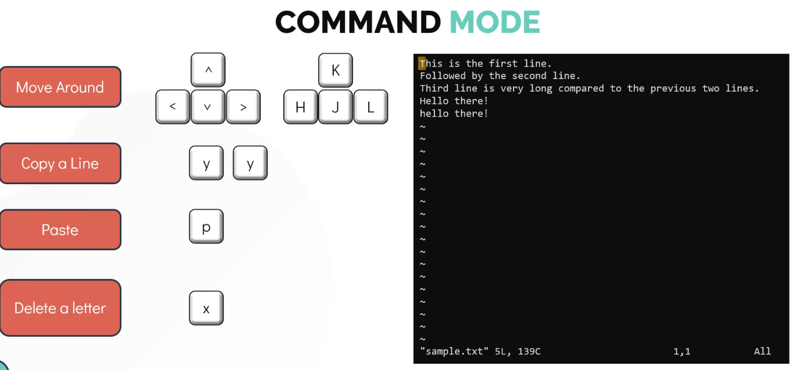

Modes
1. Command Modes (understands only commands)
2. Insert mOde
3. Last Line Modes

 Flow:

Command Mode:

Insert Mode: 
 press i, o, a 
 command mode :  esc

 Last Line Mode: 
 save: :w
 quit: :q
 save& quit: :wq
 quit: :q!